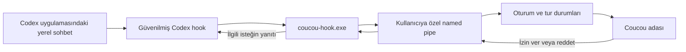

# Codex masaüstü sohbetleriyle canlı entegrasyon planı

Tarih: 2026-10-01. Durum: Windows hook entegrasyonu uygulandı; canlı kanıt ve kontrol sınırları [doğrulama notunda](CODEX-DESKTOP-CAPABILITIES.md).

## Hedef

Coucou adasında, Codex uygulamasında yürüyen mevcut yerel sohbetlerin çalışma durumunu, araç işlemlerini ve tamamlanmasını göstermek; desteklenen izin isteklerini aynı sohbete geri iletmek. İlk teslim Windows içindir. Normal ChatGPT sohbetleri ve bulutta çalışan görevler için aynı yerel hook erişimi varsayılmaz.

## Mevcut durum

Uygulama `feat/codex-support` tabanındaki `codex/desktop-live-integration` dalında geliştirildi; kabul edilmiş dış tıklama düzeltmesi de korundu. Codex desteğinin bulunduğu sürümün `windows/src-tauri/src/hooks.rs`, `windows/hook/src/main.rs`, `windows/src-tauri/src/pipe.rs`, `windows/src/island/hooks.ts` ve `windows/src/core/state.ts` bileşenleri uygulama başlangıç noktası olarak incelenmelidir. O sürümün dahili sohbeti bağımsız `codex exec --json` çalıştırır; açık masaüstü sohbetine bağlandığı anlamına gelmez. Uygulamaya geçerken Codex desteğini içeren güncel taban seçilmelidir.

## Önerilen mimari

Bu olay hattı araç ve yaşam döngüsü görünürlüğü içindir. Her yanıtın token düzeyinde aktarılması veya aynı sohbete mesaj gönderilmesi ayrı yeteneklerdir.

## Aşamalar ve çıkış koşulları

1. **Gerçek masaüstü bağlantısını kanıtla.** Masaüstü sürümü, yerel çalışma modu, etkin config katmanı, hook konumu, trust akışı ve izin profilini belirle. Küçük bir deneme projesinde gerçek masaüstü sohbetinden mesaj, araç çalışması, bitiş ve kesinti olaylarının röleye ulaştığını doğrula. Kaynak yüzeyini yalnız doğrulanan metadata ile işaretle. Kurulumun ardından yeni tur, sohbet veya uygulama yeniden başlatması gerekip gerekmediğini kaydet. CLI başarısı bu aşamanın yerine geçmez. Hook çalışmıyorsa ikinci aşamaya geçmeden desteklenen plugin veya uygulama bağlantı kanalını araştır ve kısıtı bildir.

2. **Canlı sohbet kartlarını tamamla.** Provider/session/turn kimliğine göre bağımsız kartlar üret. Kullanıcıya proje, çalışma durumu, son araç eylemi ve bitiş özeti göster. Çalışıyor, izin bekliyor, tamamlandı, kesildi ve bağlantı bilinmiyor durumlarını ayır. Eski turun gecikmiş olayı yeni turu kapatmasın. İki eşzamanlı sohbet birbirinin durumunu değiştirmesin. Kaynak olayından görünür kart güncellemesine hedef gecikme bir saniyenin altıdır; ölçümle doğrulanır. Desteklenmeyen araçlar için hayali ayrıntı üretme.

3. **Gerçek masaüstü izinlerini bağla.** İzin isteyen profil altında zararsız marker dosyasıyla Allow/Deny doğrula. Yanıt tam ilgili oturum/tur/isteğe dönsün. Adanın kapalı, duraklatılmış, bağlantısız veya isteğin süresi dolmuş olduğu durumlarda yerel Codex onayına geri dönülsün. İzin istemeyen profilde kart gelmemesi normaldir; yalnız demo amacıyla izin profilini değiştirme. Birden fazla bekleyen isteğin sırasını ve süresi dolan kartların kaldırılmasını doğrula.

4. **Çift yönlü sohbet kontrolünü ayrı değerlendir.** Sohbete geçiş, devam mesajı ve durdurma için uygulamanın gerçekten sunduğu dış bağlantı ve yetki kanalını araştır. Bu konuşmadaki app araçlarının varlığı Coucou executable'ının onlara erişebildiğini kanıtlamaz. Desteklenen kanal varsa exact thread kimliğiyle bağla ve gönderim/iptali doğrula. Ayrı app-server başlatıp thread/resume yapmak mevcut canlı masaüstü runtime'ına bağlanma kanıtı değildir. Böyle bir kanal yoksa ilk sürüm canlı izleme ve hook onaylarıyla teslim edilir; devam mesajları masaüstü uygulamasından yazılır.

5. **Ürün doğrulaması ve teslim.** Gerçek Windows masaüstünde iki sohbet, kesinti, yeniden açılma, geç gelen olay, Allow/Deny, Coucou kapanması ve Claude regresyonunu dene. Kurulum, güncelleme ve kaldırma başka araçların hook'larını korusun. İlgili Rust/frontend testleri, derleme ve paketleme geçsin. Masaüstünde doğrulanan ve henüz desteklenmeyen yetenekler açıkça belirtilsin. Public PR öncesi metadata ve loglar özel içerik açısından denetlensin.

## Veri ve uyumluluk sınırları

Başlık ve kısa eylem özeti için gereken minimum veriyi kullan. Tam transkript, credential veya auth dosyası okuma; prompt ve araç argümanlarını kalıcı loglara yazma. Transkript/SQLite izlemeyi ana entegrasyon protokolü yapma. Hook'ların tüm hosted araçları gözlemlediğini varsayma. macOS ve uzak/bulut sohbetleri ayrıca doğrulanır.

## Kaynaklar

- Yerel README.md: Claude Code hook/röle mimarisi.
- https://learn.chatgpt.com/docs/hooks : olaylar, kaynak katmanları, trust ve araç kapsamı.
- https://learn.chatgpt.com/docs/app-server : RPC ve transport; mevcut masaüstü sürecine erişim ayrıca kanıtlanmalıdır.

Plan için uygulama kodu, hook kurulumu, kullanıcı izinleri veya çalışan sohbetler değiştirilmedi.
