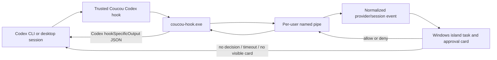
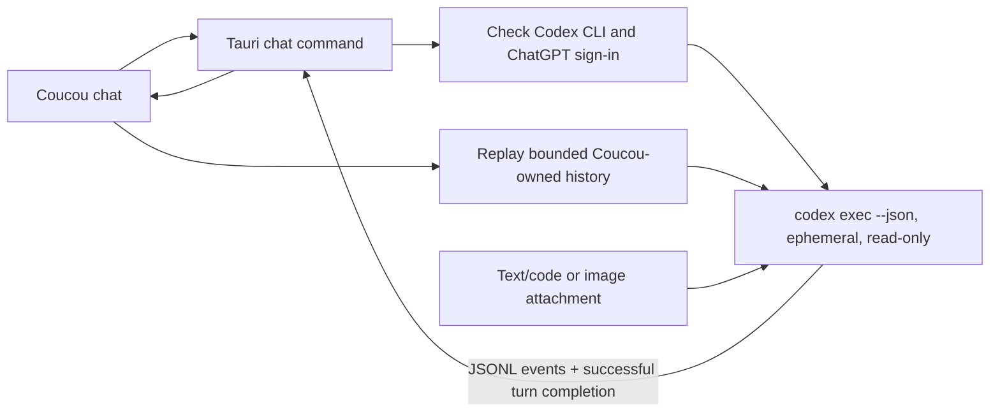

# Windows Codex support plan

This document records the implementation and release boundary for the first Codex PR. The PR targets the Windows Tauri app. macOS stays Claude Code-only and is planned as a separate PR.

## Chosen product behavior

- Windows supports Claude Code and Codex hooks at the same time. Installing or removing either provider must leave the other provider's settings intact.
- The built-in chat keeps Claude as its default provider for existing users. A provider setting can select Codex. Claude continues to use the saved Anthropic API key; Codex uses the locally installed CLI and its saved login. Codex defaults to ChatGPT subscription authentication; OpenAI API authentication is an explicit, separately billed option. Coucou never stores an OpenAI API key or silently changes billing modes.
- Codex chat runs one isolated `codex exec --json` process per turn. It does not attach to or mutate an existing Codex desktop or CLI thread. Coucou replays its own bounded chat history into each fresh run.
- Codex chat runs read-only with approval disabled, without loading user configuration or policy rules, and without persisting a Codex rollout. Coucou's version gate is 0.151.0 or later; 0.151.0 is the first version verified for this integration, not a claim about the earliest historical version supporting each flag.
- Text and code attachments up to 200 KB are sent inline. Images use Codex's `--image` input with the validated path in Coucou's file inbox. Coucou does not make a second scratch copy; the existing inbox lifecycle owns attachment retention and cleanup. PDFs are explicitly unsupported by the Codex chat route until a real extraction path exists; show an explanation and never silently omit the attachment.
- Hook installation is opt-in from Coucou Settings and remains previewed, backed up, fingerprinted, and reversible. After installation the user reviews and trusts Coucou's current hook definition in Codex CLI with `/hooks`.

## Windows architecture seams and acceptance contract

The first column records the pre-Codex Windows seam; the second describes the
Codex integration contract reviewers should verify in this PR.

| Area | Existing seam | Codex acceptance contract |
|---|---|---|
| Hook install | [`hooks.rs`](../windows/src-tauri/src/hooks.rs) edits `%USERPROFILE%\\.claude\\settings.json`, merges marker-owned entries, creates a dated backup, shows a diff, and rejects a stale preview fingerprint. | Add a separate Codex installer path at `%CODEX_HOME%\\hooks.json` or `%USERPROFILE%\\.codex\\hooks.json`. Codex may also load inline hooks from `config.toml`, and it combines matching sources. Edit only the dedicated JSON file; leave all other sources alone. Never write both representations for the same Coucou events. |
| Relay | [`hook/src/main.rs`](../windows/hook/src/main.rs) reads hook JSON from stdin, truncates long strings, removes large/private fields, sends one newline-delimited record through a per-user named pipe, and formats Claude's permission response. | Accept Codex's actual stdin schema and invoke with an explicit provider discriminator. Keep provider/session/turn ids and the exact permission target. Return Codex's nested JSON decision on stdout; Claude's hook output must remain byte-for-byte compatible. |
| IPC | [`pipe.rs`](../windows/src-tauri/src/pipe.rs) forwards events to the island and waits for a human only after an approval card acknowledges that it is visible. | Carry the provider and Codex session/turn identity through event and decision routing. Bound payload size and wait duration. Every timeout, app-close, hidden-card, disconnect, or unknown decision must leave Codex's normal approval prompt in control. |
| UI event handling | [`island/hooks.ts`](../windows/src/island/hooks.ts) maps Claude event names and tools onto one fixed `integration_claude` task. | Normalize provider events, add Codex tool names, and key activity by provider plus Codex session id. A second project/session must not replace another task or steal its approval. |
| Settings | [`settings/main.ts`](../windows/src/settings/main.ts) currently has Claude hooks and Anthropic API-key/model sections. | Keep Claude controls and defaults. Add a separate Codex hook install/status section and a chat-provider selector. Explain Codex sign-in and trust review without asking for an API key. |
| Chat | [`claude.rs`](../windows/src-tauri/src/claude.rs) stores a multi-turn Anthropic Messages conversation, sends files as API-specific blocks, and adds web search. [`views/chat.ts`](../windows/src/views/chat.ts) owns the visible history and attachment context. | Add a Codex runner behind the existing chat command boundary. Keep Claude's state, key, model, file behavior, and default intact. Parse JSONL strictly and only publish a final answer after successful process and turn completion. |
| Settings state | [`settings.rs`](../windows/src-tauri/src/settings.rs) persists the Claude model and install state. | Persist a `claude`/`codex` provider choice with Claude as the default for migrated settings. Keep Codex model override optional; empty means the CLI's default. Do not persist credentials. |

## Target flows





The two flows are independent: installing hooks observes Codex sessions that the user starts in Codex; choosing Codex in Coucou chat starts a separate task. The chat subprocess must not be described as the open Codex desktop conversation.

## Hook contract and safety rules

The supported Codex hook input is one JSON object on stdin. Use only the documented event fields needed by the UI: `hook_event_name`, `session_id`, `turn_id`, `cwd`, `source`, `prompt`, `tool_name`, `tool_input`, and `last_assistant_message` as applicable. Do not open `transcript_path` or transmit transcripts. Drop large `tool_response` content; preserve small status fields such as an exit code if the relay needs to distinguish a failed Bash call.

Use the Codex event set that maps cleanly to the Windows experience: `SessionStart`, `UserPromptSubmit`, `PreToolUse`, `PermissionRequest`, `PostToolUse`, `Stop`, `Interrupt`, `SessionEnd`, `SubagentStart`, `SubagentStop`, `PreCompact`, and `PostCompact`. Codex does not document Claude's `Notification`, `PostToolUseFailure`, or `StopFailure` events. `Stop` is a turn boundary and includes `last_assistant_message`; `SessionEnd` is a later thread lifecycle event, so it cannot be the only signal used to clear a finished turn. `Interrupt` must not be shown as successful completion.

`PermissionRequest` runs only when Codex is about to ask for approval. It supports a small tool-name matcher set that includes `Bash`, `apply_patch`, and MCP tool names. Its `tool_input` for Bash and `apply_patch` uses `command`. Approval and denial must use the documented nested shape:

```json
{"hookSpecificOutput":{"hookEventName":"PermissionRequest","decision":{"behavior":"allow"}}}
```

```json
{"hookSpecificOutput":{"hookEventName":"PermissionRequest","decision":{"behavior":"deny","message":"Denied from Coucou"}}}
```

Do not implement Claude's **Always** action for Codex. `updatedPermissions` is unsupported for Codex `PermissionRequest`; unknown actions should fail closed to the normal prompt. If no user decision arrives, emit no decision JSON and exit successfully so Codex's regular approval UI can proceed. Never emit allow because of timeout, parse failure, missing target, disabled hooks, unavailable Coucou, or a stale request id.

Codex hooks are enabled by default in the verified CLI, but users can turn the feature off. Do not rewrite their feature settings. If hooks are explicitly disabled, explain that the user can enable them with `codex features enable hooks`. Ordinary non-managed hooks still require the user to review and trust the exact current hook definition. A changed definition needs review again. The installer must tell the user to open Codex CLI and run `/hooks`; it must not use `--dangerously-bypass-hook-trust` to make Coucou hooks work.

Codex can load several hook sources at once, and matching hooks run concurrently. Installer/status/uninstall logic therefore needs to identify only Coucou's unique command marker in the chosen user-level source, leave plugin/repository/other user entries in place, and report duplicate definitions instead of deleting other tools' entries.

## Chat subprocess contract

The Codex provider is an adapter behind the existing Tauri `chat_send` command. For each turn:

1. Confirm Codex CLI is discoverable and its saved login matches the selected authentication mode. Subscription mode requires ChatGPT login; the optional API mode requires a saved API-key login. Reject signed-out or mismatched login before inference. Strip inherited API-key environment variables in both modes and pin `forced_login_method` on every exec to prevent a login change racing the status check from changing billing. Missing or unknown saved preferences default to subscription mode.
2. Invoke the CLI without a shell and with `--json`, `--ephemeral`, `--ignore-user-config`, `--ignore-rules`, `--skip-git-repo-check`, `--sandbox read-only`, and `approval_policy='never'`. Do not grant workspace writes. Run from a Coucou-controlled scratch directory so target-repository project hooks/config are not unexpectedly loaded. Preserve the normal local Codex credential directory only for authentication.
3. Send the current user query and a bounded, escaped replay of prior Coucou chat turns through stdin. Keep provider conversations separate; switching provider or resetting chat must not replay the other provider's history. Cap each input and the total prompt, and return a clear error before launching when it exceeds the limit.
4. Read stdout as bounded JSON Lines. Tolerate recognized progress/item events; retain the latest completed `agent_message`; collect diagnostics from `error`; reject malformed records, output overflow, process timeout, nonzero process exit, `turn.failed`, missing `turn.completed`, or a completed turn with no usable message. A standalone `error` event can be diagnostic while the stream continues; it must not make a failed/missing completion look successful.
5. Handle cancellation, app shutdown, simultaneous sends, and reset while a process is running. A late result from an older request must not append into a reset/reselected provider's chat. Kill/reap the child on cancellation or timeout. Image input uses the existing validated inbox file directly; do not create or delete a duplicate scratch attachment, because inbox retention belongs to Coucou's existing file lifecycle.

Text and code attachments up to 200 KB may be encoded into the prompt. Images should use the CLI's `--image` flag with a safe staged path if required by the Windows sandbox. Reject unsupported PDFs with a visible explanation. Never claim image/PDF support from the Claude API block implementation; its format is provider-specific.

## Implementation sequence

1. **Freeze the Windows-only boundary.** Keep macOS Swift sources untouched in this PR. Record the existing Claude hook/chat behavior as compatibility expectations.
2. **Introduce provider-aware state and commands.** Keep persisted settings migration backward-compatible (`chatProvider = claude` when absent). Model tasks by provider and session identity, and pending approvals by unique request id.
3. **Add the Codex relay contract.** Parse bounded stdin safely; forward normalized session/turn/tool data; implement only Codex allow/deny output; keep Claude path untouched. Add parser/decision unit coverage before wiring the UI.
4. **Add Codex installation preview/apply/remove.** Use a separate Codex settings path and a unique marker. Refuse malformed or unreadable config; make a backup before write; fingerprint preview input; preserve unrelated content; write atomically; test install/update/uninstall and stale preview behavior. State exactly where hook trust is reviewed.
5. **Wire Codex activity and permissions into the Windows island.** Map Codex tools to useful labels and target summaries. Keep separate session cards; test overlap and late/out-of-order events.
6. **Add the Codex chat adapter.** Discover the CLI, validate ChatGPT login, invoke the isolated read-only JSONL route, implement bounded history, provider reset/concurrency cancellation, and explicit attachment support/error behavior. Keep Claude as the default provider.
7. **Run regression, Windows packaging, and live smoke tests.** Only after all checks pass, review the complete diff and prepare the PR. The PR should state any remaining limits; do not describe the macOS PR as included.

## Acceptance and test matrix

| Layer / case | Setup | Required result |
|---|---|---|
| Default settings migration | Load settings without `chatProvider`. | Chat still selects Claude; saved Claude model and hook state are unchanged. |
| Provider switch | Alternate Claude and Codex chat selections and reset chat. | Each provider uses only its own in-memory history; a provider/model change or reset may clear the visible conversation, but must never replay one provider's turns into the other. Claude credentials/config remain intact. |
| CLI discovery | Test PATH install, native npm install, missing CLI, executable path with spaces, and non-executable/broken shim. | Correct binary is selected or a clear actionable error appears; never launch through interpolated shell text. |
| Subscription auth | CLI signed in using `codex login` with ChatGPT; inspect only redacted status. | Codex chat works through the existing CLI login with no API key field in Coucou. |
| API key auth | Explicitly select API mode and save CLI API-key login; separately test each login/mode mismatch and inherited `CODEX_API_KEY`/`OPENAI_API_KEY`. | API mode requires saved API-key login; subscription mode requires saved ChatGPT login. Mismatches are refused, ambient keys stripped, and CLI auth pinned. Switching mode resets history and rejects stale sends/replies. |
| JSONL success | Use `exec-success.jsonl`. | Return the completed assistant message only after `turn.completed`. |
| Progress before final | Use `exec-commentary-final.jsonl`. | Ignore non-message items, keep the most recent completed assistant message, and require completed turn. |
| CLI failure | Use `exec-failure.jsonl`; separately simulate nonzero exit and timeout. | Surface safe, bounded diagnostics; do not save a partial assistant turn as success. |
| Missing completion | Use `exec-no-completion.jsonl`. | Reject despite a preceding completed message item. |
| Malformed JSONL | Use `exec-malformed-line.jsonl`. | Reject the stream and do not publish an earlier partial message as completed. |
| Output bounds | Simulate oversized JSONL line/stream and deeply nested input. | Stop safely at configured bounds; keep memory use bounded; no panic or unbounded UI text. |
| Reset/concurrency | Start turn A, reset or switch provider, then finish A after turn B. | A's late response cannot enter the new provider/history; each child is reaped on cancellation. |
| Text/code attachment | Test at 0, 200 KB, and 200 KB + 1 byte, including Unicode and binary-looking text. | Inline only supported bounded text; oversize/invalid UTF-8 reports a clear limit/type error. |
| Image attachment | Test supported image formats, spaces/Unicode path, missing file, and file removed during send. | `--image` receives the correct validated inbox path; errors are clear; no duplicate scratch file is created or left behind. |
| PDF attachment | Ask Codex chat about a PDF. | Explicit unsupported-format message; no silent omission and no Claude-format block sent to Codex. |
| Codex hook config install | Use absent file, empty file, valid existing hooks, duplicate Coucou entry, and other user's hooks. | Preview/diff is correct; only Coucou-owned entries are added/updated/removed. |
| Codex config failures | Test malformed JSON, unreadable file, backup failure, write failure, and config changed after preview. | Abort without destructive overwrite; stale fingerprint rejects; backup/write operations are verified. |
| Claude regression | Run existing Claude hook installer/relay tests and a Claude API chat test or mock. | Existing Claude settings, event response JSON, Anthropic chat, file contexts, and default provider still work. |
| Codex hook contract | Feed Codex fixtures for SessionStart, prompt, tools, Stop, Interrupt, and PermissionRequest. | Session/turn ids and required target survive; unsupported fields are ignored safely; Stop uses `last_assistant_message`. |
| Permission allow/deny | Trigger a real Codex permission request; click each action. | Allow/deny JSON has exact nested schema; the terminal/Codex approval path sees the decision. Do not present **Always**. |
| Permission fallback | Close/quit Coucou, pause/hide island, decline, disconnect pipe, send malformed payload, or time out. | Relay exits boundedly with no decision JSON; Codex's original permission prompt remains available. |
| Overlapping approvals/sessions | Run two Codex sessions and two simultaneous approval requests; send decisions and events out of order. | One request cannot overwrite another; the card clearly identifies provider/project/tool target; each reply reaches its original session. |
| Hook trust/feature gate | Test with feature enabled, explicitly disabled, untrusted hook, then trusted hook; change definition and retry. | Do not change the feature setting; if disabled, explain how the user can enable it. Before trust, normal Codex behavior continues with no Coucou approval; after trust, Coucou receives events; changed hook prompts for review again. |
| Platform boundary | Inspect changed files and build target. | No Swift/macOS changes; Windows app, relay, settings, and docs are the only runtime scope. |
| Windows release build | Clean install/build via documented toolchain. | Tauri app and `coucou-hook.exe` package; CLI absent still leaves normal app/Claude path usable. |

## Validation status (2026-09-30)

- **Passed live CLI subscription smoke:** Codex CLI 0.151.0, signed in through ChatGPT, completed `codex exec` with the exact expected response `COUCOU_CODEX_OK`.
- **Passed native production-app chat smoke:** launched the production Tauri app with isolated `APPDATA` and `LOCALAPPDATA` and a real saved ChatGPT login. Selecting Codex in Settings and sending through chat IPC returned exact `COUCOU_NATIVE_OK`; the UI returned `ORANGE` and correctly recalled it on a follow-up. Real `ingest_file` + `chat_send` IPC returned `BLUE42` for a text fixture and `Red` for a valid red PNG. A PDF produced the explicit unsupported-format error. Switching the saved provider to Claude produced the actionable missing-key error; no Claude API key was available, so a successful Claude API turn was not exercised.
- **Passed native relay/app permission smoke with synthetic hook input:** the release `coucou-hook.exe` sent `SessionStart`, `UserPromptSubmit`, `PreToolUse`, and `PermissionRequest` events to the production Tauri app. Clicking Allow and Deny returned the documented JSON decisions. With Coucou closed, the relay emitted no output and exited successfully in 64 ms. This verifies relay/app behavior for synthetic payloads; it does **not** verify Codex CLI hook trust or real CLI-originated events.
- **Passed automated checks after final hardening:** `npm test` passed 12/12, including authentication-mode transitions; `cargo test --workspace --locked` passed 49 tests (38 app-library and 11 relay). The separate live ChatGPT subscription test passed 1/1. `npm ci` reported zero audit vulnerabilities; TypeScript, Vite, relay release build, and NSIS packaging passed. Shell regression tests execute the generated Windows command through both cmd.exe and PowerShell with Unicode paths, stdin/stdout, and exit-code propagation.
- **Passed final clean dependency install and packaging:** `npm ci`, `npm test`, and `npm run pack` completed after chat-transition retry, hook-preservation, and provider-label fixes. The final NSIS installer is `windows/release/Coucou-Windows-0.1.1-setup.exe` (4.07 MiB). Dependency audit reported zero vulnerabilities. Remote CI is pending.
- **Passed genuine CLI hook acceptance:** reviewed and trusted all 12 hook definitions through CLI 0.151.0's normal review screen in an isolated profile. SessionStart, UserPromptSubmit, PreToolUse, PostToolUse, Stop, and PermissionRequest reached the native app. Allow created the expected marker file; Deny returned `Denied from Coucou` and created no file. With Coucou closed, Codex displayed its normal terminal approval prompt; cancelling created no file. This test exposed and fixed a PowerShell command-launch bug that synthetic relay tests had missed.
- **Passed native authentication acceptance:** signed-out login shows an actionable error. Selecting API mode with saved ChatGPT login, or subscription mode with saved API login, refuses inference. Stale `authMode` IPC is rejected. Explicit API mode recognized a saved dummy key, reached the official Responses endpoint, and surfaced its expected 401 without saving a reply. No valid OpenAI or Anthropic API test key was available, so successful paid API inference remains unverified. Claude's real HTTP request/response path, headers, file/window context, multi-turn history, and error rollback passed against a local mock server (5 Claude tests total).

### Manual Codex CLI hook acceptance recipe

Use a disposable Windows profile or a temporary `CODEX_HOME`, with a throwaway project directory. Sign in to Codex with ChatGPT if that profile needs credentials, and launch Coucou from the same environment so it resolves the same Codex hook directory.

1. In Coucou Settings, preview and install Codex hooks. In Codex CLI, run `/hooks` and review/trust Coucou's current hook definition.
2. Start Codex in the throwaway project. Ask it to create a harmless marker file there; confirm the permission request appears in Coucou, click Allow, and verify the marker file is created.
3. Ask it to create a second marker file; click Deny and verify that file is absent and the Codex session continues normally.
4. Close Coucou and trigger another harmless action requiring approval. Confirm Codex shows its regular terminal approval prompt and is not left waiting for Coucou.
5. Uninstall Coucou's hooks, confirm unrelated hook entries remain, then remove the temporary project and profile data.

Do not use a real repository for the marker-file checks. Do not capture account identifiers, auth files, or conversation transcripts in test logs or screenshots.

## PR exit criteria

- The Windows unit/test suite passes, including fixture-driven CLI parsing, hook payload/decision shapes, settings migrations, and installer preservation/failure cases.
- Front-end type-check/build, Rust tests, and clean Windows packaging all pass. Record exact commands and outcomes in the PR.
- A live Windows hook smoke test uses Codex CLI 0.151.0 and a ChatGPT-signed-in account; it verifies real `/hooks` trust, a CLI-originated tool event, one allow, one deny, and fallback after Coucou is closed. Only the synthetic relay/app portion is currently confirmed. Do not put account identifiers, auth files, or prompt transcripts in logs or screenshots.
- Live chat checks passed for subscription replies, context retention, text/image attachments, PDF rejection, signed-out login, login/mode mismatches, API-key 401 handling, and Claude missing-key behavior. Successful paid OpenAI/Anthropic inference is not claimed; mocked Claude HTTP regression is included.
- Existing Claude hooks/chat pass regression checks. Hook commands are removed and reinstalled in a temporary profile or backed-up test profile so the developer's real configs are not used as test fixtures.
- `git diff --check` is clean; review confirms no auth material, local settings, generated build artifacts, or unrelated changes are staged.

## Verified limitations and decisions

- Codex hooks need user review/trust; installation alone does not activate them.
- `PermissionRequest` can only answer when Codex is about to ask. Hooks do not surface every action or hosted tool. Codex documents local tool hooks for `Bash`, `apply_patch`, MCP, and other local tools, but hosted tools such as web search do not use that path.
- Codex has no documented `updatedPermissions` response for `PermissionRequest`; “Always allow” is not part of this integration.
- The chat route starts an independent one-shot CLI task, so it will not continue a user's existing Codex desktop chat. Replaying bounded local history is an intentional tradeoff for avoiding new app-server state and persistent thread files.
- The Codex CLI and Codex hook format can evolve. Keep integration tests pinned to known fixtures and a live smoke test against the verified CLI version before release.
- macOS remains unchanged in the first PR. A later macOS PR needs its own provider/session model, hook/approval mapping, and live macOS validation.

## Official references

- [Codex hooks: locations, trust, inputs, outputs, events, and limitations](https://learn.chatgpt.com/docs/hooks)
- [Codex non-interactive mode: `codex exec`, JSONL events, sandboxing, ephemeral runs, and saved authentication](https://learn.chatgpt.com/docs/non-interactive-mode)
- [Codex CLI reference: `exec` flags and configuration overrides](https://learn.chatgpt.com/docs/developer-commands?surface=cli)
- [Codex authentication: ChatGPT subscription login and API-key billing distinction](https://learn.chatgpt.com/docs/auth)
